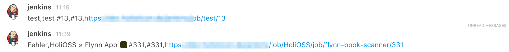
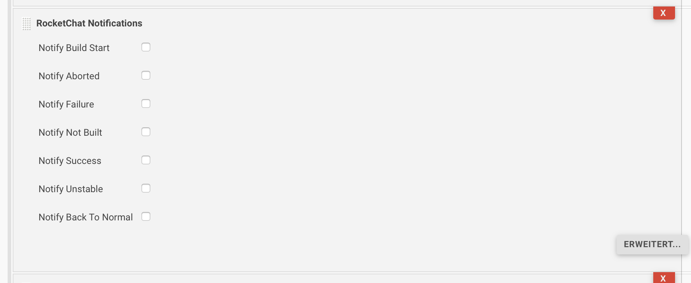
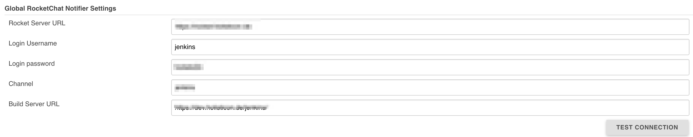

# Rocket Chat Notification Plugin for Jenkins

[](https://travis-ci.org/jenkinsci/rocketchatnotifier-plugin) 
[](https://ci.jenkins.io/blue/organizations/jenkins/Plugins%2Frocketchatnotifier-plugin/branches/)
[](https://martinreinhardt-online.de/jenkins/job/rocketchatnotifier-plugin/job/master/)
[](https://codecov.io/gh/jenkinsci/rocketchatnotifier-plugin)
[](https://snyk.io/test/github/jenkinsci/rocketchatnotifier-plugin)

The latest stable version is available at Plugins Center. Dev builds are available via the [Experimental Plugins Update Center](https://jenkins.io/blog/2013/09/23/experimental-plugins-update-center/).

## Usage

You can use it in the Workflow/Pipeline DSL
```
node {
    try {
     ...
    } catch (e) {
        rocketSend channel: 'abc', message: 'test'
        throw e
    }
}
```
If you omit channel you can shorten it as it would now use the global default channel:
```
node {
    try {
     ...
    } catch (e) {
        rocketSend 'test'
        throw e
    }
}
```

The message looks then like this:



It also works with normal jobs:




## Admin settings

You can define a default notification channel:




# Contribution

## Bugs

If you find a bug in the source code or a mistake in the documentation, you can help us by
submitting an issue to our [JIRA](https://issues.jenkins-ci.org/browse/JENKINS-39690?jql=project%20%3D%20JENKINS%20AND%20component%20%3D%20rocket-chat-notifier-plugin). Even better you can submit a Pull Request
with a fix.

First search if the issue is already described!

If not create a new issue:

* Tell about your environment:
  * operating system and version
  * Jenkins version
  * Java version
  * RocketChat version
* Describe your issue
  * describe your steps leading to the issue
  * attach error logs or screenshots
  * if possible provide test case or screenshots
